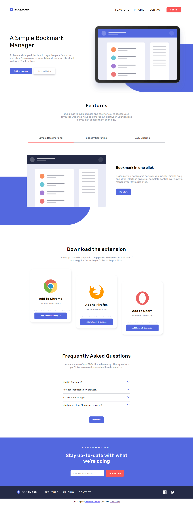

# Frontend Mentor - Bookmark landing page solution

This is a solution to the [Bookmark landing page challenge on Frontend Mentor](https://www.frontendmentor.io/challenges/bookmark-landing-page-5d0b588a9edda32581d29158). Frontend Mentor challenges help you improve your coding skills by building realistic projects. 

## Table of contents

- [Overview](#overview)
  - [The challenge](#the-challenge)
  - [Screenshot](#screenshot)
  - [Links](#links)
- [My process](#my-process)
  - [Built with](#built-with)
  - [What I learned](#what-i-learned)
  - [Continued development](#continued-development)
  - [Useful resources](#useful-resources)
- [Author](#author)
- [Acknowledgments](#acknowledgments)

**Note: Delete this note and update the table of contents based on what sections you keep.**

## Overview

### The challenge

Users should be able to:

- View the optimal layout for the site depending on their device's screen size
- See hover states for all interactive elements on the page
- Receive an error message when the newsletter form is submitted if:
  - The input field is empty
  - The email address is not formatted correctly

### Screenshot

- Desktop Preview

### Links

- Solution URL: [Solution](https://bookmark-landing-page-master.netlify.app/)

## My process

### Built with

- Semantic HTML5 markup
- CSS custom properties
- Flexbox
- CSS Grid
- Mobile-first workflow

### What I learned

I learned how to create toggle elements using Vanilla Javascript using some primitive logic.
I don't feel very proud of CSS in this and  found that there is a major scope for learning and improvement especially
about Mobile first Workflow and Responsive design.

### Continued development

- Make the design pixel perfect
- Work on the Hamburger Menu and implement sliding menu
- Make CSS more compact and reduce the lines of code
- Right now there are about 7 Media Queries varying with respect to different widths, but I wish to make them
  as los as possible as I continue learning more about CSS.
- Implementation of the same Landing Page using React 

### Useful resources

- [Dropdown Menu](https://www.w3schools.com/howto/howto_js_dropdown.asp) - This helped me with toggle different elements. 

- [Flexbox Guide](https://css-tricks.com/snippets/css/a-guide-to-flexbox/) - This is an amazing article/cheatsheet for Flexbox. I'd recommend it to anyone still learning this concept.

## Author

- Frontend Mentor - [@suraj-singh127](https://www.frontendmentor.io/profile/suraj-singh127)

## Acknowledgments

This was a really good challenge and I really enjoyed doing it. I got to know and implement many interesting things along with
my weakpoints on which I really need to work on along with brushing up the already strong points.
